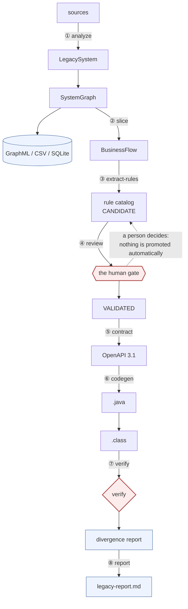

# legacy-refactoring-framework

Framework para análise estrutural, extração de comportamento, formalização de
contratos e verificação da modernização de sistemas legados, utilizando LLMs
**apenas** onde a interpretação semântica é necessária.

O ponto de partida é uma constatação: modernizar um sistema legado exige
primeiro escrever o que ele faz, e essa escrita é o gargalo. Automatizá-la de
forma ingênua produz uma especificação confiante e errada, e o erro aparece
meses depois em produção. Por isso a tese do projeto é:

> **Toda afirmação sobre comportamento é rastreável até o código que a
> justifica, e o que não pode ser mostrado não é afirmado.**

Onde o pipeline é determinístico, ele é determinístico. Onde há ambiguidade
real — a extração de regras de negócio — a incerteza é explícita e isolada
atrás de uma porta. E a revisão humana é uma invariante do modelo de dados, não
uma convenção que alguém pode esquecer.

## O pipeline



O diagrama completo, com artefatos e recusas de cada estágio, está em
[docs/pipeline.md](docs/pipeline.md).

## Começando

Requer **Python 3.12+** e [uv](https://docs.astral.sh/uv/). O `make demo`
também requer **Docker** (para o OpenAPI Generator e o build Maven); o
`make test` não requer nada além do Python.

```bash
git clone <repo> && cd legacy-refactoring-framework
uv sync
make test          # unit tests: no LLM, no Docker, no Java
make demo          # the whole chain, end to end
```

`make demo` roda o pipeline inteiro sobre o fixture VB6 de exemplo: parse →
grafo → clusters → slice → regras → revisão → contrato OpenAPI → Java 21
compilado em bytecode → Golden Master → relatório. A saída vai para
`output/vb6/`.

## O gate humano

O pipeline para em `review`. As regras extraídas entram como `CANDIDATE` e
só viram `VALIDATED` por decisão de uma pessoa:

```bash
legacyctl review RULE-CUSTOMERFORM_VALIDATECUSTOMER-002 \
  --approve --reviewer ana --note "confirmed against Customer.frm:88"
```

Isso não é burocracia: é o ponto. Um modelo pode propor uma regra; ninguém
deveria automatizar a promoção. `make pipeline` para aqui de propósito — um
Makefile que aprova sozinho tornaria o gate decorativo.

`make demo` abre a porta explicitamente via `review-all`, gravando
`reviewer=make-demo` e a nota "bulk approval, not a per-rule review" em cada
regra — para que o catálogo sempre registre se a porta foi aberta de propósito.

## Comandos

A CLI é um comando por estágio, e cada estágio é executável sozinho:

```bash
legacyctl analyze <dir>                    # grafo, clusters, hubs, SQLite
legacyctl clusters                         # lista clusters e hubs
legacyctl slice --entry <E> --depth <N>    # corta um fluxo
legacyctl extract-rules --slice <file>     # propõe regras candidatas
legacyctl rules                            # lista o catálogo
legacyctl review <rule-id> --approve ...   # o gate
legacyctl validate                         # o catálogo é revisável?
legacyctl contract                         # OpenAPI 3.1 (só regras validadas)
legacyctl codegen --compile                # OpenAPI → .java → .class
legacyctl verify --golden-master <file>    # Golden Master vs novo sistema
legacyctl report                           # legacy-report.md
```

## O que o pipeline **não** faz

Isto é tão importante quanto o que ele faz:

- **Não gera lógica de negócio.** O Java gerado é a superfície contratual:
  DTOs, request/response, enums, interfaces. Decidir o que o código deve *fazer*
  é trabalho do time. Automatizar essa suposição é exatamente a falha que o
  projeto existe para evitar.
- **Não promove regra sozinho.** Ver acima.
- **Não usa LLM por padrão.** O extrator default é determinístico e offline.
  Nenhum dado legado sai da máquina sem pedido explícito
  (`--provider` ou `LEGACYCTL_LLM_PROVIDER`).
- **Não adivinha quando não sabe.** Um caller não resolvido é
  `CallKind.UNRESOLVED`, não omitido. Um SQL sem schema declarado fica
  `db_schema=None` com `ParseStatus.PARTIAL`. Um caso de Golden Master que não
  pode ser decidido é `SKIPPED`, nunca `PASSED`.
- **Não afirma que o catálogo está Java compilado** se não compilou. A cadeia
  real é `OpenAPI → OpenAPI Generator → .java → build → .class`, e o
  relatório não medi nada que não rodou.

## Princípios

- **Proveniência é um tipo, não um comentário.** Uma regra não existe sem
  `sources` com `arquivo:linha`. Uma transição de estado carrega
  `evidence_kind` (`OBSERVATION` vs `INFERENCE`) — hipótese e fato não podem
  parecer iguais num relatório.
- **Determinismo é requisito, não acidente.** Todos os ids são derivados do
  conteúdo, então o catálogo é diffável. O clustering fixa a seed do Louvain
  (ver [ADR 003](docs/adr/003-sqlite-graph.md) e o comentário em
  `clustering/louvain.py`): sem isso, a mesma entrada produzia 5 clusters numa
  execução e 6 na outra, e cada `cluster_id` mudava sozinho.
- **Segurança em duas camadas.** O contexto enviado a um modelo passa por
  `security/sanitizer.py`, e o log redige de novo na saída. O slice já é
  sanitizado no disco, então o arquivo é seguro para compartilhar.

## Verificação

A verificação usa Golden Master (ver
[ADR 007](docs/adr/007-golden-master.md)) com casos curados a partir de
**evidência real** do legado — um caso sem evidência aceita é recusado no
carregamento (ver [ADR 009](docs/adr/009-golden-master-curado.md)).

Duas formas de "sistema novo":

```bash
legacyctl verify --golden-master catalog/golden-master/vb6.yaml
#   --new-system simulator   (default) avalia as regras validadas, offline
#   --new-system http        posta o caso num serviço real
```

O simulator é explicitamente uma simulação: avalia o que as regras determinam e
reporta `fired`/`not_fired` para guardas cuja decisão o legado nunca declara.
Ele não fabrica um `accept`/`reject` para poder dizer que passou.

Uma divergência é o produto: o relatório diz qual regra, qual fluxo e qual
`arquivo:linha`, para guidear a reconciliação. Um Golden Master que passa de
primeira é suspeito; um que falha com divergências precisas é útil.

## Documentação

- [docs/architecture.md](docs/architecture.md) — camadas, onde a inteligência
  é permitida, fronteiras de segurança
- [docs/domain-model.md](docs/domain-model.md) — os tipos e o porquê de cada
  campo
- [docs/pipeline.md](docs/pipeline.md) — estágios, artefatos, recusas, exit
  codes
- [docs/adr/](docs/adr/) — 10 Architecture Decision Records, cada um com as
  alternativas rejeitadas e o custo real da escolha

## Estado

MVP funcional. O fixture VB6 de exemplo roda ponta a ponta e produz bytecode
Java real. A verificação com Golden Master curado roda; o número de casos
`SKIPPED` reflete regras cuja decisão o legado não declara — é uma lacuna
visível por design, não um bug.

Limitação conhecida: a cobertura completa do parser VB6 exige o ProLeap
(instalado via `LEGACYCTL_PROLEAP_JAR`). Sem ele, o pipeline roda com um
fallback estrutural que marca o que não resolveu como `UNKNOWN` — cobre menos,
mas não mente (ver [ADR 008](docs/adr/008-proleap-java-bridge.md)).

## Desenvolvimento

```bash
make test          # unit tests only
make test-all      # + CLI integration tests
make lint          # ruff check + format --check
make typecheck     # mypy (strict)
make sync          # uv sync
```

## Licença

Ver [LICENSE](LICENSE).
