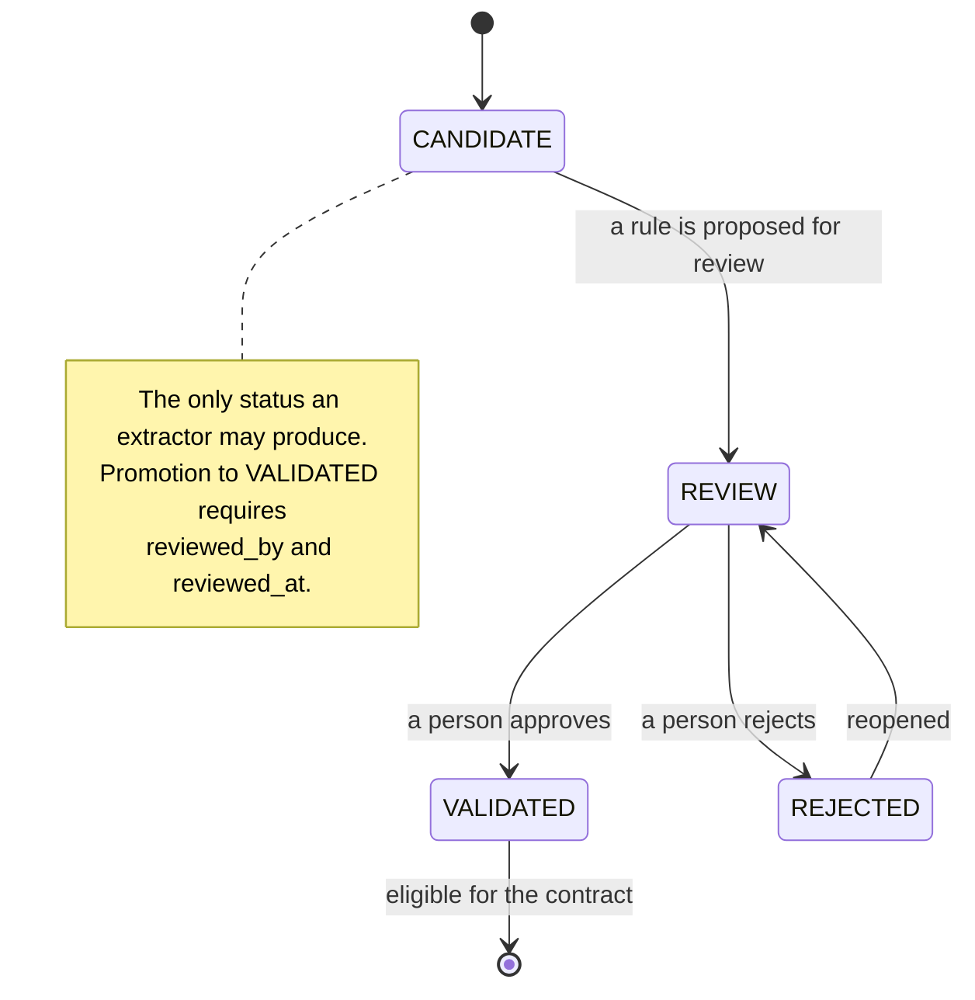
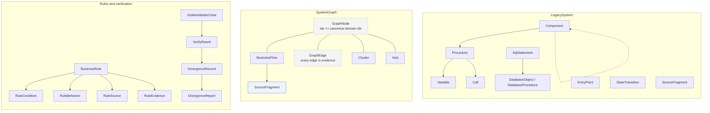

# Domain Model

What the tool knows, and why each type exists. The guiding question for every
type here: *if this field were wrong, would the tool lie?*

All ids are content-derived (see `domain/ids.py`) and therefore stable across
runs. `LegacySystem` is the aggregate root; everything else hangs off it or off
its graph.

## Aggregate: `LegacySystem`

The parsed legacy system. Holds `components`, `procedures`, `calls`,
`sql_statements`, `database_objects`, `entry_points`, `state_transitions` and
`source_fragments`.

Each `Component` carries its own `parse_status`. A system is only as trustworthy
as its weakest component, and per-component status is what lets a reader see
that `Customer.bas` parsed cleanly while `Relatorio.bas` did not, instead of
getting one undifferentiated verdict for the whole folder.

## Structure

`Component` — a form, module, class. Owns procedures, variables, entry points.

`Procedure` — a `Sub` or `Function`. Carries `kind`, `parameters`,
`return_type`, `start_line`/`end_line`, and `source` (a `SourceLocation`).

`Variable` — a local, a parameter, a module-level field. Two fields exist to stop
two specific lies:

- `is_return` distinguishes a function's return value from an OUT parameter. A
  VB6 `Function` returns a value; it does not have OUT parameters, and
  conflating the two invents a contract that does not exist.
- `type_confidence` records whether the type was observed or inferred. A
  parameter with no declared type is not a string; it is unknown.

`Call` — one call site: `caller_id`, `callee_name`, `line`, `call_expression`,
`arguments`. `CallKind` is the honesty boundary:

| Kind | Meaning |
|---|---|
| `STATIC` | resolved to a procedure in this system |
| `DYNAMIC` | the target is computed at runtime |
| `EXTERNAL` | a VB6 intrinsic or a library, not project code |
| `UNRESOLVED` | we saw a call and could not resolve it |

`UNRESOLVED` is kept rather than dropped. A dropped call would quietly shrink
the graph, and every slice computed from that graph would be confidently wrong.

## Data

`SqlStatement` — normalized via SQLGlot, with `tables`, `views`, `columns`,
`operation`, `access_mode` and `is_dynamic`.

`db_schema` is nullable and stays null when the source does not say. A `{call
.executar_consistencia(?, ?)}` with no schema is recorded with `db_schema=None`,
and the parse status is `PARTIAL`. Inventing a schema name here would propagate
a fabricated identity into the OpenAPI contract.

`DatabaseObject` / `DatabaseProcedure` — tables, views and stored procedures,
with `in_params`/`out_params`.

OUT parameters are modelled on the *procedure*, never on the VB6 caller. See
[ADR 010](adr/010-procedures-estado-contrato.md) for why: the parameters belong
to the database contract, and attaching them to a VB6 signature invents a
coupling the legacy code does not have.

`StateTransition` — `from_state`, `to_state`, `trigger`, and crucially
`evidence_kind` (`OBSERVATION` / `INFERENCE` / `UNKNOWN`). A state machine
observed in code is a fact; one inferred from procedure names is a hypothesis,
and the two must not look the same in a report.

## Graph

`SystemGraph` — `nodes`, `edges`, `clusters`, `hubs`, `flows`.

Node and edge ids are the *canonical* ids of the domain objects they represent,
so `PROC-CUSTOMERFORM-VALIDATECUSTOMER` is one identifier everywhere: in the
system, in the graph, in a slice, and in a divergence report. Ids that differ
per layer are how a report ends up pointing at a rule nobody can find in the
code.

`Cluster` carries `size`, `share_of_system`, `cohesion` and a `warning`. The
giant-cluster flag exists because a single 60%-of-the-system cluster is the
signal that the slice needs a human's judgement about where to start.

`Hub` records *why* it is a hub (`reason`), not just its score, so a reader can
tell a genuinely central procedure from one that is central because everything
calls the same database helper.

## Flow

`BusinessFlow` — a bounded slice from one entry point: `node_ids`, `edge_ids`,
`procedure_ids`, `sql_ids`, `database_object_ids`, `hub_references`,
`truncated`, `context_token_estimate`.

Two fields carry most of the weight:

- `truncated` — the depth limit stopped the traversal. A truncated slice is a
  valid result but not a complete one, and the difference matters when someone
  concludes "this flow only touches these tables".
- `hub_references` — hubs the slice touched, reported rather than absorbed. A
  hub is a warning that the slice is not as bounded as it looks, not a reason to
  silently drag in its whole neighbourhood.

`SourceFragment` — the source text handed to the extractor, with `sanitized:
bool`. A slice is written to disk already sanitized, so the artifact is safe to
share without a second pass.

## Rules

`BusinessRule` — the only type in the system that can be `VALIDATED`, and only
after human review.

`sources: list[RuleSource]` is required and non-empty by construction: each
entry carries `file`, `line`, `procedure`. This is the traceability guarantee
that makes the tool's output reviewable.

`RuleCondition` holds the `expression` as observed plus the `fields` it reads.
The expression is never rewritten into a "cleaner" form, because a normalised
condition that no longer matches the source is not evidence of anything.

`RuleBehavior.type` is `"unknown"` when the extractor could not determine what
the legacy code actually *does*. This is a first-class value and it propagates:
the contract generator writes "behaviour: not determined" into the OpenAPI
description rather than implying a decision exists.

`RuleConfidence` is about the *extraction*, and is independent of `RuleStatus`.
A high-confidence extraction can still be rejected by a reviewer who knows the
code better; a reviewed rule is validated regardless of its confidence.

## Verification

`GoldenMasterCase` — curated expectations. Refused at load time when `evidence`
is missing or is not one of the accepted sources, because a case that cannot
name where its expectation came from is a guess. `confidence: low` makes a case
advisory: reported, never blocking.

`VerifyResult` — one comparison. `SKIPPED` is distinct from `PASSED` on purpose:
when neither the rule nor the evidence can decide the case, the honest answer
is that nobody knows, not that the systems agree.

`DivergenceRecord` — one difference, always carrying `rule_id`, `flow_id` and
`source`, plus `blocking`. The `blocking` flag lives on the record rather than
being derived at report time, so "does this fail the build" is a property of the
finding instead of a calculation someone can get wrong.

## Type-dependency map

